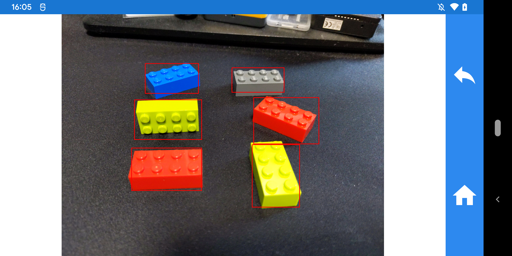

# TensorFlow Lite example for Xamarin

* Lego detecting with [Xamarin.TensorFlow.Lite](https://www.nuget.org/packages/Xamarin.TensorFlow.Lite)
* Create TensorFlow Lite model with [Custom Vision](https://www.customvision.ai/)

